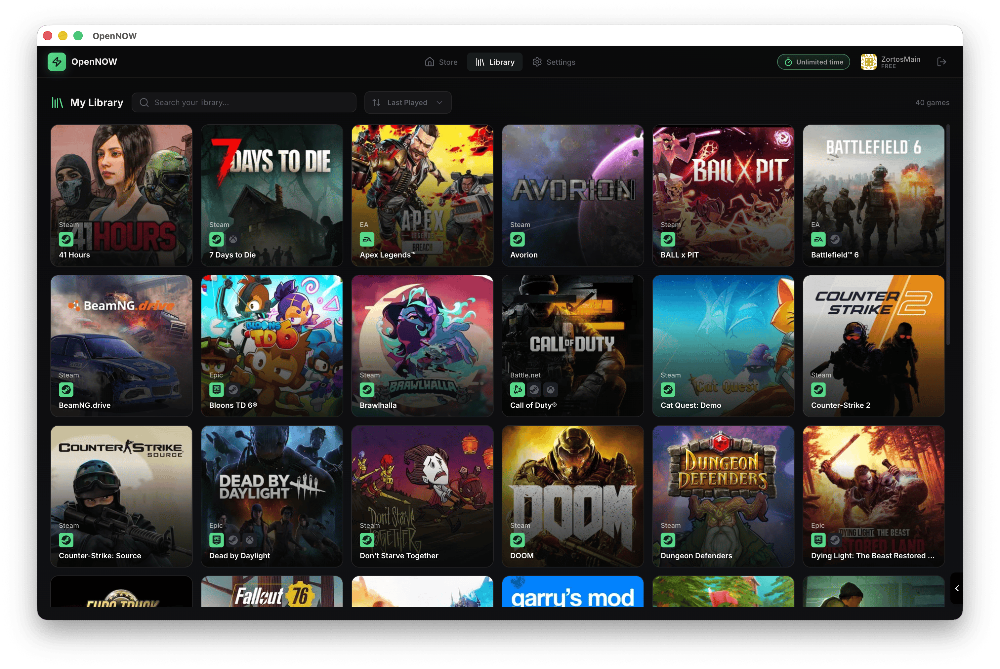

<h1 align="center">OpenNOW</h1>

<p align="center">
  
</p>

<p align="center">
  <strong>An open-source desktop client for GeForce NOW.</strong>
</p>

<p align="center">
  Browse the catalog, tune your stream, and launch sessions from a community-built app.
</p>


<p align="center">
  <a href="https://github.com/OpenCloudGaming/OpenNOW/releases">
    
  </a>
  <a href="https://opennow.zortos.me">
    
  </a>
  <a href="https://github.com/OpenCloudGaming/OpenNOW/actions/workflows/auto-build.yml">
    
  </a>
  <a href="https://discord.gg/8EJYaJcNfD">
    
  </a>
</p>

<p align="center">
  <a href="https://github.com/OpenCloudGaming/OpenNOW/stargazers">
    
  </a>
  <a href="https://github.com/OpenCloudGaming/OpenNOW/releases">
    
  </a>
  <a href="LICENSE">
    
  </a>
</p>

<p align="center">
  
</p>

> [!WARNING]
> OpenNOW is under active development. Expect occasional bugs, rough edges, and platform-specific issues while the client matures.

> [!IMPORTANT]
> OpenNOW is an independent community project and is not affiliated with, endorsed by, or sponsored by NVIDIA. NVIDIA and GeForce NOW are trademarks of NVIDIA Corporation. You must use your own GeForce NOW account.

## Overview

OpenNOW is a community-built Electron app for playing GeForce NOW from an open-source desktop client. The active implementation lives in [`opennow-stable/`](opennow-stable) and uses Electron, React, and TypeScript across the main, preload, and renderer processes.

The project aims to give players a transparent, customizable alternative to the official client without hiding the technical parts from contributors.

## Highlights

- Open-source desktop client for Windows, macOS, and Linux
- Catalog and public game browsing with search and library-aware session handling
- Stream controls for codec, resolution, FPS, aspect ratio, region, and quality preferences
- In-stream diagnostics overlay with latency, packet loss, decode, and render stats
- Built-in screenshots, recording, microphone controls, and controller-friendly navigation
- Local settings storage and zero-telemetry project direction

## Quick Start

### Download

Grab the latest build from [GitHub Releases](https://github.com/OpenCloudGaming/OpenNOW/releases).

Current packaging targets:

| Platform | Formats |
| --- | --- |
| Windows | NSIS installer, portable executable |
| macOS | `dmg`, `zip` |
| Linux x64 | `AppImage`, `deb` |
| Linux ARM64 | `AppImage`, `deb` |

### Develop Locally

From the repository root:

```bash
cd opennow-stable
npm install
cd ..
npm run dev
```

Useful root scripts:

```bash
npm run dev
npm run build
npm run typecheck
npm run dist
```

For a fuller setup guide, see [docs/development.md](docs/development.md).

## Repository Layout

```text
.
├── opennow-stable/   Electron app workspace
├── docs/             Local project documentation
├── .github/          Workflows, templates, contributing docs
├── logo.png          Project logo
└── img.png           App preview image
```

## Documentation

- [Development Guide](docs/development.md)
- [Contributing Guide](.github/CONTRIBUTING.md)
- [Project Website](https://opennow.zortos.me)

## Architecture At A Glance

OpenNOW is split into three Electron layers:

| Layer | Tech | Responsibility |
| --- | --- | --- |
| Main | Electron + Node.js | OAuth, CloudMatch/session orchestration, signaling, caching, local file handling |
| Preload | Electron `contextBridge` | Safe IPC bridge between the app shell and UI |
| Renderer | React + TypeScript | Login flow, browsing, settings, WebRTC playback, diagnostics, controls |

The code lives under [`opennow-stable/src/`](opennow-stable/src), with shared TypeScript types and IPC contracts in [`opennow-stable/src/shared/`](opennow-stable/src/shared).

## Contributing

Contributions are welcome. If you want to help:

1. Read the [contributing guide](.github/CONTRIBUTING.md).
2. Run `npm run typecheck` and `npm run build` before opening a PR.
3. Keep changes focused and explain user-facing impact clearly.

## FAQ

### Is this the official GeForce NOW client?

No. OpenNOW is a third-party, community-maintained client.

### Does OpenNOW collect telemetry?

The current project direction is zero telemetry. Settings and media stay on the local machine, and authentication is performed against NVIDIA services.

### What happened to the earlier Tauri/Rust version?

The active client in this repository is the Electron-based app in [`opennow-stable/`](opennow-stable).

## Star History

<a href="https://www.star-history.com/?repos=OpenCloudGaming%2FOpenNOW&type=date&legend=top-left">
 <picture>
   <source media="(prefers-color-scheme: dark)" srcset="https://api.star-history.com/image?repos=OpenCloudGaming/OpenNOW&type=date&theme=dark&legend=top-left" />
   <source media="(prefers-color-scheme: light)" srcset="https://api.star-history.com/image?repos=OpenCloudGaming/OpenNOW&type=date&legend=top-left" />
   
 </picture>
</a>

## License

OpenNOW is licensed under the [MIT License](LICENSE).
